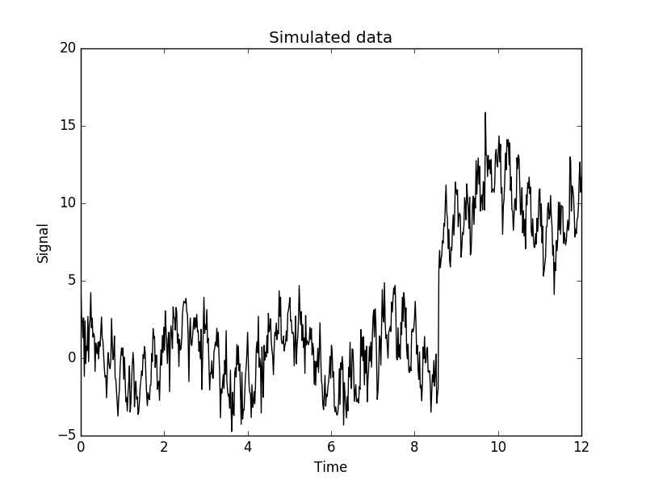

# Powerspectrum analysis in C

Version 0.1

## Setup
From bash shell
```
git clone ...
```

## Running

```
powerspectrum();
```


## Example1

Simulated data with 700 data points between `t_0 = 0` and `t_1 = 12`. The data contains three different signals with frequencies of `4`, `2` and `0.4`
with random noise added on top. Additionally, I have added a jump in the data set to showcase that it is possible to remove such signatures.


## Example2
