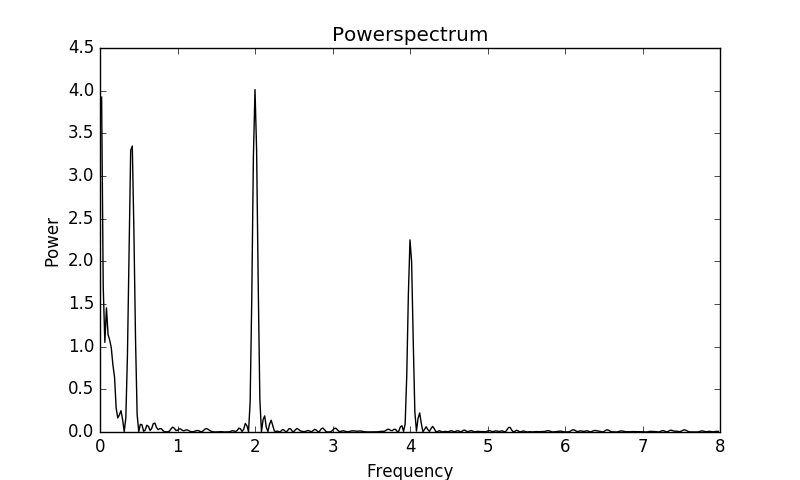

# Powerspectrum analysis in C

Version 0.1

## Setup
From bash shell
```
git clone ...
```

## Running

```
powerspectrum();
```


## Example1


Simulated data with 700 data points between `t0 = 0` and `t1 = 12`. The data contains three different signals with frequencies of `4`, `2` and `0.4`
with random noise added on top. Additionally, I have added a jump in the data set to showcase that it is possible to remove such signatures.

Below you see the jump corrected data using
```
correctJump(dataSt, 1);
```


The first argument is the input data loaded into the data structure and the second argument corrects `1` jumps.

Lastly you see the powerspectrum from frequencies `freq_initial = 0` to `freq_final = 8` which clearly shows three peaks at the correct frequencies:


## Example2
